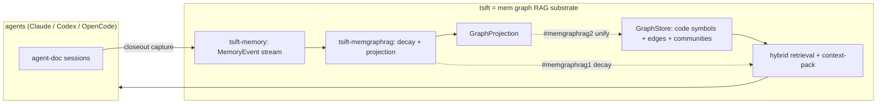

# MemGraphRAG Direction

**Status:** All three layers implemented (core) — `#memgraphrag1` decay retrieval, `#memgraphrag2` graph unification, `#trt1` authored nodes (core), `#memgraphrag-ont` ontology layer. Remaining: `#rankdefault` unified ranking + `#trt1` follow-on phases (capture/injection/projection).
**Source:** [arxiv 2606.00610 — *MemGraphRAG: Memory-based Multi-Agent System for Graph Retrieval-Augmented Generation*](https://arxiv.org/pdf/2606.00610)
**Tracking:** ✅ `#memgraphrag1`, `#memgraphrag2`, `#trt1` (core), `#memgraphrag-ont`; backlog `#rankdefault`

## Summary

MemGraphRAG augments Graph-RAG with (1) a persistent **memory graph** of agent
interactions and decision history, (2) **temporal decay** on retrieval so stale
information is deprioritized, and (3) a multi-agent framework, evaluated on
multi-hop QA (HotpotQA / 2WikiMultiHopQA / MuSiQue) against GraphRAG, RAPTOR, and
LightRAG.

**tsift is already ~70% of the way to this architecture.** The graph, memory, and
RAG pillars all have an existing home in the codebase. The remaining work is
temporal decay in retrieval and unifying the memory graph with the code graph.
The multi-agent orchestration layer is deliberately **out of scope** for tsift.

## Pillar mapping: paper → tsift

| MemGraphRAG pillar | tsift today | Gap |
|---|---|---|
| **Graph** — node/edge schema, hierarchical traversal | `GraphStore` over SQLite/SurrealDB: symbols/edges, communities, callers/callees, `properties_json`/`provenance_json`/`freshness_json` | none — substrate exists |
| **Memory** — agent interactions, decision history | `tsift-memory`: `MemoryEvent` stream (`PromptTarget`/`ToolCall`/`ToolResultArtifact`/`ResponseSummary`/`CloseoutProof`/`SessionCheck` + `Imported*`), cross-session `MemoryHandoffPlan`, claude-mem import | none — durable substrate exists |
| **RAG** — retrieval + context aggregation | `tsift-memgraphrag`: memory-event `GraphProjection`, budgeted `MemoryQueryPlan`, shared graph upsert, semantic/source rows; hybrid BM25 + structural search, `context-pack` injection | unified graph ranking remains `#rankdefault` |
| **Decay / recency** | `tsift-memgraphrag::rank_memory_event_candidates` reads a bounded FTS/recent candidate set from `tsift-memory`, then ranks over `MemoryEvent.observed_at_unix`; `community_graph_watermark` staleness signal | decay not yet folded into default graph-neighborhood ranking |
| **Multi-agent** | tsift is the *shared substrate* read/written by Claude / Codex / OpenCode harnesses (`session_id`, `imported_from`) | orchestration is **not** (and should not be) tsift's job |

## Architecture

## Gaps and roadmap

### 1. Authored memory nodes anchored to code — `#trt1` ✅ implemented (core)

Implemented in `packages/tsift-memory/src/lib.rs`:
- `AuthoredNodeKind` (`Finding` / `Decision` / `Note`) and
  `authored_node_projection(kind, text, anchor_handle, confidence, observed_at_unix, session_id)`
  build a content-stable node anchored to a stable symbol handle (graph node id /
  tagpath — not a line number) via an `annotates` edge, with `confidence`
  (clamped 0..=1), `observed_at_unix` freshness, and provenance.
- CLI: `tsift memory finding-add --text <t> --anchor <handle> [--kind decision|note] [--confidence c]`
  (`packages/tsift-cli/src/commands/memory.rs`). The `annotates` edge requires
  the anchor node to exist (FK); when it does not, the authored node is still
  recorded (carrying `anchor_handle`) and the edge is deferred until the anchor
  lands (`anchor_resolved` in the report).

Follow-on phases (queued separately): `context-pack` / search injection,
`community_graph_watermark` staleness gating, opt-in/passive capture from
agent-doc session archives, and md/html projection.

### 2. Temporal decay-weighted retrieval — `#memgraphrag1` ✅ implemented

The paper's signature mechanism. Implemented in `packages/tsift-memgraphrag/src/lib.rs`:

- `MemoryDecayConfig { half_life_secs, lexical_weight, recency_weight }` — default
  one-week half-life, 0.6 lexical / 0.4 recency blend.
- `rank_memory_events(events, query, now_unix, config, limit) -> Vec<ScoredMemoryEvent>`
blends a lexical-overlap component with exponential recency decay
(`0.5 ^ (age / half_life)`) over `MemoryEvent.observed_at_unix`; events without a
timestamp keep their lexical score but earn no recency credit. Ties break toward
the more recent event. `ScoredMemoryEvent` exposes `lexical_score` /
`recency_score` / `score` for explainability.
- `read_memory_event_candidates(memory_db, query, limit)` uses `memory_events_fts`
plus `COALESCE(observed_at_unix, created_at_unix)` / `created_at_unix` indexes to
fetch FTS hits and a recent fallback into a deduplicated, bounded candidate set.
`rank_memory_event_candidates(memory_db, query, now_unix, config, limit)` ranks
only that candidate set instead of scanning every stored memory event.
- `MemoryQueryPlan` now carries the `decay` config so `tsift memory query-plan`
documents the ranking contract, including the candidate limit used before
ranking.

Still to do: fold this into `#rankdefault` (`ranked_neighborhood`) so memory and
code share one ranking function once memory nodes are in the graph (below).

Performance baseline: `fixtures/memgraphrag-performance-history.json` records the
canonical four-surface latency sample shape for MemGraphRAG work. Running
`tsift metric-digest --input fixtures/memgraphrag-performance-history.json --json`
emits `memgraphrag_performance_gate`, which requires memory query, memory
project-graph, `graph-db related`, and semantic seeded neighborhood latency
metrics and blocks on missing baseline/current metrics or >25% latency regression.

### 3. One graph, not two — `#memgraphrag2` ✅ implemented (core)

`tsift-memgraphrag`'s `project_memory_events` emits `tsift-core` `GraphProjection`
nodes/edges, and `SqliteGraphStore::upsert_projection` already ingests them. The
wiring is now in place:

- `tsift memory project-graph [PATH] [--graph-db 
] [--limit N]` reads stored
  memory events, projects them (`memory_session` / `memory_event` nodes,
  `records_memory_event` edges), and upserts them into the shared
  `.tsift/graph.db` so memory nodes are queryable alongside code symbols via the
  same `graph-db` retrieval surface (`packages/tsift-cli/src/commands/memory.rs`,
  `tsift_memgraphrag::project_memory_into_graph`).

Remaining for full unification: decay-aware ranking over the merged graph
(`#rankdefault`).

### 4. Semantic Ontology Graph layer — `#memgraphrag-ont` ✅ implemented

The paper's third layer (typed backbone). Implemented as a **data-driven** schema
derived from the instance graph (`SqliteGraphStore::derive_ontology`,
`packages/tsift-sqlite/src/lib.rs`) and materialized through
`tsift_memgraphrag::derive_memory_ontology_graph`:
- one `ontology_type` node per distinct node kind (with `instance_count`), and
- one `ontology_relation:<edge_kind>` edge per observed `(from_kind, edge_kind,
  to_kind)` triple (with `instance_count`).

Existing ontology rows are excluded from the derivation so it is idempotent and
never folds itself in. CLI: `tsift memory ontology-graph` derives and upserts the
layer back into `.tsift/graph.db`, so types + permitted relations are queryable
alongside instances and retrieval can start from abstract types.

**Ontology source (decided):** the base ontology = code `NodeKind`/edge-kind enums
+ `#trt1` authored-node types, surfacing automatically because the derivation is
empirical over whatever node/edge kinds exist (code symbols, memory nodes, authored
findings). An existence-lang ontology may be folded in as a basis **when a project
actually uses existence-lang** (not always present); otherwise this efficient
data-driven representation stands.

## Out of scope: multi-agent orchestration

The paper's multi-agent framework is an LLM-orchestration concern. tsift's role is
the retrieval/memory **substrate** that multiple harnesses share — cross-agent
coordination belongs in agent-doc / the harnesses, not in tsift. tsift already
gets the "multi-agent memory" benefit for free via `session_id` / `imported_from`
on `MemoryEvent`, without owning any orchestration logic.

## Suggested phasing

1. **`#memgraphrag1`** — decay-weighted memory retrieval (smallest, reuses
   existing fields; measurable on retrieval-quality gates alongside `#rankdefault`).
2. **`#trt1`** — authored Finding/Decision/Note nodes (capture + schema).
3. **`#memgraphrag2`** — unify memory `GraphProjection` with code `GraphStore`
   into a single retrieval surface.

Each phase is independently shippable and leaves tsift a usable code-RAG if the
direction is paused.
