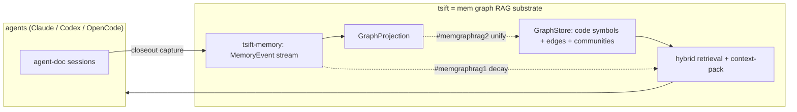

# MemGraphRAG Direction

**Status:** Direction / proposal (not yet implemented)
**Source:** [arxiv 2606.00610 — *MemGraphRAG: Memory-based Multi-Agent System for Graph Retrieval-Augmented Generation*](https://arxiv.org/pdf/2606.00610)
**Tracking:** backlog `#trt1`, `#rankdefault`; gated `#memgraphrag1`, `#memgraphrag2`

## Summary

MemGraphRAG augments Graph-RAG with (1) a persistent **memory graph** of agent
interactions and decision history, (2) **temporal decay** on retrieval so stale
information is deprioritized, and (3) a multi-agent framework, evaluated on
multi-hop QA (HotpotQA / 2WikiMultiHopQA / MuSiQue) against GraphRAG, RAPTOR, and
LightRAG.

**tsift is already ~70% of the way to this architecture.** The graph, memory, and
RAG pillars all have an existing home in the codebase. The remaining work is
temporal decay in retrieval and unifying the memory graph with the code graph.
The multi-agent orchestration layer is deliberately **out of scope** for tsift.

## Pillar mapping: paper → tsift

| MemGraphRAG pillar | tsift today | Gap |
|---|---|---|
| **Graph** — node/edge schema, hierarchical traversal | `GraphStore` over SQLite/SurrealDB: symbols/edges, communities, callers/callees, `properties_json`/`provenance_json`/`freshness_json` | none — substrate exists |
| **Memory** — agent interactions, decision history | `tsift-memory`: `MemoryEvent` stream (`PromptTarget`/`ToolCall`/`ToolResultArtifact`/`ResponseSummary`/`CloseoutProof`/`SessionCheck` + `Imported*`), `GraphProjection` (events→graph), budgeted `MemoryQueryPlan`, cross-session `MemoryHandoffPlan`, claude-mem import | memory graph is **separate** from the code graph |
| **RAG** — retrieval + context aggregation | hybrid BM25 + structural search, `context-pack` injection | retrieval has **no temporal decay** |
| **Decay / recency** | `observed_at_unix` on each `MemoryEvent`; `community_graph_watermark` staleness signal | not wired into ranking |
| **Multi-agent** | tsift is the *shared substrate* read/written by Claude / Codex / OpenCode harnesses (`session_id`, `imported_from`) | orchestration is **not** (and should not be) tsift's job |

## Architecture

## Gaps and roadmap

### 1. Authored memory nodes anchored to code — `#trt1` (already specced)

Add `Finding` / `Decision` / `Note` nodes to `GraphStore`, anchored by stable
symbol-handle / tagpath edges (not line numbers), with provenance + confidence +
freshness fields gated on `community_graph_watermark` for staleness. Retrieval via
`context-pack` / search injection; opt-in/passive capture from agent-doc session
archives; graph store as source of truth. This *is* the mem-graph roadmap — do not
duplicate it. See `specs/graph.md` and `SPEC.md`.

### 2. Temporal decay-weighted retrieval — `#memgraphrag1` (gated)

The paper's signature mechanism and the one capability tsift lacks. The fields
already exist (`MemoryEvent.observed_at_unix`, `community_graph_watermark`); they
are simply not factored into ranking. Add recency/decay weighting to memory
retrieval scoring in `MemoryQueryPlan` (`packages/tsift-memory/src/lib.rs`,
~`query_plan`), reusing the existing staleness signals, and coordinate with
`#rankdefault` (`ranked_neighborhood`) so memory and code share one ranking
function. Lowest-risk first step toward this direction.

### 3. One graph, not two — `#memgraphrag2` (gated)

Today `tsift-memory`'s `GraphProjection` (`packages/tsift-memory/src/lib.rs`,
~`projection`) and the code `GraphStore` are separate. Merging them so authored
memory nodes (`#trt1`) and code symbols live in a single queryable graph surface
(`context-pack` / search injection) is the architectural move that earns the
"mem graph RAG" label: memory stream + code graph + decay retrieval over one
substrate. Depends on `#trt1` and a product decision.

## Out of scope: multi-agent orchestration

The paper's multi-agent framework is an LLM-orchestration concern. tsift's role is
the retrieval/memory **substrate** that multiple harnesses share — cross-agent
coordination belongs in agent-doc / the harnesses, not in tsift. tsift already
gets the "multi-agent memory" benefit for free via `session_id` / `imported_from`
on `MemoryEvent`, without owning any orchestration logic.

## Suggested phasing

1. **`#memgraphrag1`** — decay-weighted memory retrieval (smallest, reuses
   existing fields; measurable on retrieval-quality gates alongside `#rankdefault`).
2. **`#trt1`** — authored Finding/Decision/Note nodes (capture + schema).
3. **`#memgraphrag2`** — unify memory `GraphProjection` with code `GraphStore`
   into a single retrieval surface.

Each phase is independently shippable and leaves tsift a usable code-RAG if the
direction is paused.
