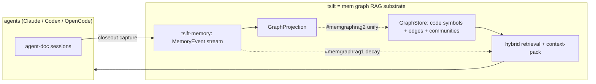

# MemGraphRAG Direction

**Status:** Phase 1 + 3 implemented (`#memgraphrag1` decay retrieval, `#memgraphrag2` graph unification); `#trt1` authored nodes still pending
**Source:** [arxiv 2606.00610 — *MemGraphRAG: Memory-based Multi-Agent System for Graph Retrieval-Augmented Generation*](https://arxiv.org/pdf/2606.00610)
**Tracking:** backlog `#trt1`, `#rankdefault`; ✅ `#memgraphrag1`, `#memgraphrag2`

## Summary

MemGraphRAG augments Graph-RAG with (1) a persistent **memory graph** of agent
interactions and decision history, (2) **temporal decay** on retrieval so stale
information is deprioritized, and (3) a multi-agent framework, evaluated on
multi-hop QA (HotpotQA / 2WikiMultiHopQA / MuSiQue) against GraphRAG, RAPTOR, and
LightRAG.

**tsift is already ~70% of the way to this architecture.** The graph, memory, and
RAG pillars all have an existing home in the codebase. The remaining work is
temporal decay in retrieval and unifying the memory graph with the code graph.
The multi-agent orchestration layer is deliberately **out of scope** for tsift.

## Pillar mapping: paper → tsift

| MemGraphRAG pillar | tsift today | Gap |
|---|---|---|
| **Graph** — node/edge schema, hierarchical traversal | `GraphStore` over SQLite/SurrealDB: symbols/edges, communities, callers/callees, `properties_json`/`provenance_json`/`freshness_json` | none — substrate exists |
| **Memory** — agent interactions, decision history | `tsift-memory`: `MemoryEvent` stream (`PromptTarget`/`ToolCall`/`ToolResultArtifact`/`ResponseSummary`/`CloseoutProof`/`SessionCheck` + `Imported*`), `GraphProjection` (events→graph), budgeted `MemoryQueryPlan`, cross-session `MemoryHandoffPlan`, claude-mem import | memory graph is **separate** from the code graph |
| **RAG** — retrieval + context aggregation | hybrid BM25 + structural search, `context-pack` injection | retrieval has **no temporal decay** |
| **Decay / recency** | `observed_at_unix` on each `MemoryEvent`; `community_graph_watermark` staleness signal | not wired into ranking |
| **Multi-agent** | tsift is the *shared substrate* read/written by Claude / Codex / OpenCode harnesses (`session_id`, `imported_from`) | orchestration is **not** (and should not be) tsift's job |

## Architecture

## Gaps and roadmap

### 1. Authored memory nodes anchored to code — `#trt1` (already specced)

Add `Finding` / `Decision` / `Note` nodes to `GraphStore`, anchored by stable
symbol-handle / tagpath edges (not line numbers), with provenance + confidence +
freshness fields gated on `community_graph_watermark` for staleness. Retrieval via
`context-pack` / search injection; opt-in/passive capture from agent-doc session
archives; graph store as source of truth. This *is* the mem-graph roadmap — do not
duplicate it. See `specs/graph.md` and `SPEC.md`.

### 2. Temporal decay-weighted retrieval — `#memgraphrag1` ✅ implemented

The paper's signature mechanism. Implemented in `packages/tsift-memory/src/lib.rs`:

- `MemoryDecayConfig { half_life_secs, lexical_weight, recency_weight }` — default
  one-week half-life, 0.6 lexical / 0.4 recency blend.
- `rank_memory_events(events, query, now_unix, config, limit) -> Vec<ScoredMemoryEvent>`
  blends a lexical-overlap component with exponential recency decay
  (`0.5 ^ (age / half_life)`) over `MemoryEvent.observed_at_unix`; events without a
  timestamp keep their lexical score but earn no recency credit. Ties break toward
  the more recent event. `ScoredMemoryEvent` exposes `lexical_score` /
  `recency_score` / `score` for explainability.
- `MemoryQueryPlan` now carries the `decay` config so `tsift memory query-plan`
  documents the ranking contract.

Still to do: fold this into `#rankdefault` (`ranked_neighborhood`) so memory and
code share one ranking function once memory nodes are in the graph (below).

### 3. One graph, not two — `#memgraphrag2` ✅ implemented (core)

`tsift-memory`'s `project_memory_events` already emits `tsift-core` `GraphProjection`
nodes/edges, and `SqliteGraphStore::upsert_projection` already ingests them. The
wiring is now in place:

- `tsift memory project-graph [PATH] [--graph-db 
] [--limit N]` reads stored
  memory events, projects them (`memory_session` / `memory_event` nodes,
  `records_memory_event` edges), and upserts them into the shared
  `.tsift/graph.db` so memory nodes are queryable alongside code symbols via the
  same `graph-db` retrieval surface (`packages/tsift-cli/src/commands/memory.rs`,
  `project_memory_into_graph`).

Remaining for full unification: authored `Finding`/`Decision`/`Note` node types
(`#trt1`) and decay-aware ranking over the merged graph. Depends on `#trt1`.

## Out of scope: multi-agent orchestration

The paper's multi-agent framework is an LLM-orchestration concern. tsift's role is
the retrieval/memory **substrate** that multiple harnesses share — cross-agent
coordination belongs in agent-doc / the harnesses, not in tsift. tsift already
gets the "multi-agent memory" benefit for free via `session_id` / `imported_from`
on `MemoryEvent`, without owning any orchestration logic.

## Suggested phasing

1. **`#memgraphrag1`** — decay-weighted memory retrieval (smallest, reuses
   existing fields; measurable on retrieval-quality gates alongside `#rankdefault`).
2. **`#trt1`** — authored Finding/Decision/Note nodes (capture + schema).
3. **`#memgraphrag2`** — unify memory `GraphProjection` with code `GraphStore`
   into a single retrieval surface.

Each phase is independently shippable and leaves tsift a usable code-RAG if the
direction is paused.
